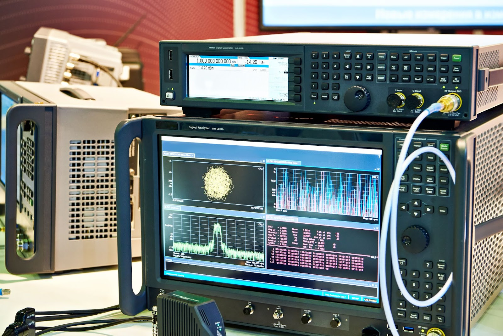

# 餘弦科技有限公司
  

餘弦科技是由認真、專業、創新結合的團隊

提供訊號量測軟體諮詢

為實驗室與工業產線提供良好的系統規劃

簡化繁瑣的操作流程、提供數據管理及輸出報表加以分析

配合工業4.0及ESG相關數據蒐集

加入生成式AI提高公司內部效能

# 服務內容

## 量測儀器開發

專注於VNA(網路分析儀)、SA(頻譜分析儀)等各類儀器軟體開發，UI設計、運算邏輯、報表輸出、系統整合一手包辦。

##  其他客製化軟體

除了量測儀器，餘弦也提供簡易客製化軟體，包括Excel比對管理、工業用Modbus等。 

 

### 聯絡我們

地址 : 桃園市中壢區中山東路四段20-2號16樓

Email : ken.hong@cosine.com.tw

Phone : 0928-665440
